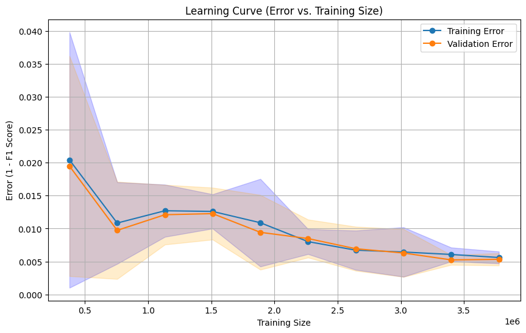
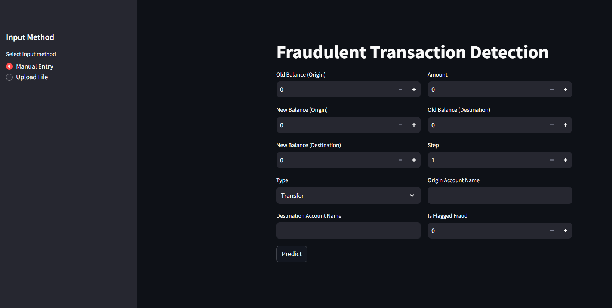

# Fraud Detection Model with AWS Deployment

This project implements a **Fraud Detection Model** designed to identify fraudulent financial transactions using machine learning. The model leverages a **Random Forest Classifier** to classify transactions as either fraudulent or non-fraudulent based on several transaction-related features. By utilizing data from accounts' balance changes and transaction amounts, the model efficiently detects suspicious activities.

---

## Architecture

<p align="center">
  
</p>

The architecture now incorporates containerization and automated CI/CD pipelines for continuous deployment. The application is built as a Docker container and deployed on an AWS EC2 instance. GitHub Actions manage the entire lifecycle—from building the Docker image, pushing it to Amazon ECR, and deploying the container on an EC2 instance—to ensure rapid and reliable updates.

---

## Table of Contents

1. [Project Overview](#project-overview)
2. [Features](#features)
3. [Model Training & Hyperparameter Tuning](#model-training--hyperparameter-tuning)
4. [Model Performance](#model-performance)
5. [Feature Importance](#feature-importance)
6. [Usage](#usage)
7. [Containerization](#containerization)
8. [CI/CD Pipeline](#cicd-pipeline)
9. [Deployment on EC2](#deployment-on-ec2)
10. [Installation](#installation)
11. [Files](#files)
12. [License](#license)

---

## Project Overview

The primary objective of this project is to detect fraudulent transactions in financial systems. The model is trained on a dataset containing several features like transaction amount, account balances before and after the transaction, and account information. By leveraging **Random Forest**, the model can differentiate between legitimate and fraudulent transactions.

### Model Approach

- **Data Preprocessing**: The dataset is cleaned and transformed for model training by handling missing values, feature scaling, and encoding categorical variables.
- **Feature Engineering**: Derived features—such as the difference in account balances—play a crucial role in detecting discrepancies that indicate fraud.
- **Modeling**: A **Random Forest Classifier** is used, and hyperparameter tuning optimizes its performance.
- **Evaluation**: The model’s effectiveness is measured via precision, recall, F1-score, and other metrics.

---

## Features

Key features used for training the model include:

- **step**: Time step of the transaction.
- **type**: Type of transaction (e.g., CASH-IN, CASH-OUT).
- **amount**: Transaction amount.
- **nameOrig**: Origin account name.
- **oldbalanceOrg**: Original balance of the origin account.
- **newbalanceOrig**: New balance of the origin account.
- **nameDest**: Destination account name.
- **oldbalanceDest**: Original balance of the destination account.
- **newbalanceDest**: New balance of the destination account.

---

## Model Training & Hyperparameter Tuning

### Hyperparameter Tuning

Grid search was used to optimize the Random Forest Classifier. The best parameters found are:

```python
{'n_estimators': 20, 
 'min_samples_split': 60, 
 'min_samples_leaf': 100, 
 'max_features': 'sqrt', 
 'max_depth': 4, 
 'class_weight': 'balanced', 
 'ccp_alpha': 0.0001}
```

### Best F1-Score

The tuned model achieved an F1-score of `0.9713`, demonstrating its accuracy in classifying transactions.

---

## Model Performance

### Evaluation Metrics

The model’s performance metrics include:

- **F1-Score**: `0.9894`
- **Precision**: `0.9838`
- **Recall**: `0.9951`

| Class              | Precision | Recall | F1-Score | Support  |
|--------------------|-----------|--------|----------|----------|
| 0.0 (Non-fraud)    | 1.00      | 1.00   | 1.00     | 942,872  |
| 1.0 (Fraud)        | 0.98      | 1.00   | 0.99     | 1,220    |
| **Accuracy**       |           |        | **1.00** | 944,092  |
| **Macro avg**      | 0.99      | 1.00   | 0.99     | 944,092  |
| **Weighted avg**   | 1.00      | 1.00   | 1.00     | 944,092  |

### Cross-Validation

The model achieved a mean F1-score of `0.9713` with a standard deviation of `0.0374` across cross-validation folds, indicating robust performance.

---

## Feature Importance

The most important features for detecting fraud include:

| Feature              | Importance |
|----------------------|------------|
| **errorbalanceOrig** | 0.386132   |
| **newbalanceOrig**   | 0.210591   |
| **oldbalanceOrg**    | 0.162828   |
| **amount**           | 0.147096   |
| **errorbalanceDest** | 0.053315   |
| **newbalanceDest**   | 0.020096   |
| **oldbalanceDest**   | 0.019941   |

The key feature, **`errorbalanceOrig`**, represents the difference in the origin account’s balance before and after the transaction, proving critical for fraud detection.

---

## Usage

### Running the Model Locally

1. **Clone the Repository:**
   ```bash
   git clone https://github.com/your-username/Fraud_Detection.git
   cd Fraud_Detection
   ```

2. **Install Dependencies:**
   ```bash
   pip install -r requirements.txt
   ```

3. **Train the Model:**
   Execute the Jupyter notebooks for EDA, data preprocessing, and model training:
   - `01_data_base_connector.ipynb`
   - `02_data_ingestion.ipynb`
   - `03_EDA_and_data_preprocessing.ipynb`
   - `04_model_building.ipynb`

4. **Make Predictions:**
   Use the prediction script in `src/pipelines/prediction.py` to test on new data.

---

## Containerization

This project is containerized using Docker to ensure consistency across environments. The Dockerfile included in the repository builds the application image. A simplified Dockerfile example:

```dockerfile
FROM python:3.9-slim
WORKDIR /app

# Copy source code and install dependencies
COPY . /app
RUN apt-get update -y && \
    apt-get install -y --no-install-recommends awscli && \
    rm -rf /var/lib/apt/lists/*
RUN pip install --no-cache-dir -r requirements.txt

# Expose the application port
EXPOSE 8080

# Start the application
CMD ["python", "frontend.py"]
```

The accompanying `.dockerignore` file excludes unnecessary files (like local virtual environments, notebooks, and CI/CD configurations) to keep the image lean.

---

## CI/CD Pipeline

The project uses GitHub Actions for continuous integration and continuous deployment (CI/CD):

- **Continuous Integration:**  
  Tests, linting, and code quality checks are run upon every push to the `main` branch.

- **Continuous Delivery:**  
  The pipeline builds the Docker image, pushes it to Amazon ECR, and triggers deployment on an EC2 instance running Docker.  
  The workflow file (`.github/workflows/main.yaml`) automates these steps, ensuring that updates are rapidly deployed to production.

---

## Deployment on EC2

The containerized application is deployed on an AWS EC2 instance:

- **Deployment Process:**  
  GitHub Actions manages the build and deployment process: after building the Docker image and pushing it to ECR, the pipeline deploys the container on the EC2 instance.

- **Accessing the Application:**  
  The EC2 instance runs the container with the appropriate port mapping (e.g., `-p 8080:8080`), making the app accessible via the instance's public IP at `https://<EC2_PUBLIC_IP>:8080`.  
  Security groups and host firewall rules are configured to allow incoming traffic on port 8080.

---

## Installation

To install the necessary dependencies, run:
```bash
pip install -r requirements.txt
```
Ensure you have Python 3.7+ and pip installed.

---

## Files

- **`notebooks/`**: Jupyter notebooks for data exploration, preprocessing, and model building.
- **`src/`**: Source code for data ingestion, preprocessing, model building, and prediction.
  - **`components/`**: Modular components for various tasks.
  - **`pipelines/`**: Prediction and model-building pipelines.
- **`artifacts/`**: Saved models and output files.
- **`Dockerfile`**: Dockerfile for containerizing the application.
- **`requirements.txt`**: Python dependencies.
- **`.github/workflows/`**: CI/CD pipeline configurations.
- **`README.md`**: This file.
- **`LICENSE`**: Project license.
- **`feature_importance.png`**: Feature importance visualization.
- **`learning_curve.png`**: Learning curve for model training.
- **`Screenshot_UI.png`**: Screenshot of the deployed UI.

---

## License

This project is licensed under the MIT License - see the [LICENSE](LICENSE) file for details.

---

### Images



The **learning curve** showcases model performance over time, indicating whether the model is overfitting or underfitting.



A screenshot of the deployed UI, which displays transaction predictions and flags suspicious activity.

```
Feel free to adjust repository URLs, file paths, and specific details to match your environment and project requirements.
```